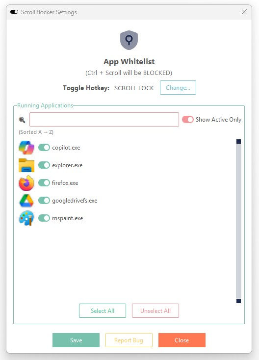

# ScrollBlocker 🖱️

**ScrollBlocker** is a lightweight Windows utility I built to stop accidental zooming or side-scrolling in apps like Excel, Photoshop, and browsers.

> ⚠️ This repo is a showcase only. The source code is private.

---

## 🚀 Features

- Blocks Ctrl+Scroll zooming
- Stops sideways scrolling on touchpads
- Per-app whitelist with icons
- Runs quietly in the tray
- Beautiful custom UI using `ttkbootstrap`

---

## 🖼️ Screenshots

| Settings UI |
|-------------|
|  |

---

## 🛠️ Built With

- Python 3.12
- `tkinter`, `ctypes`, `pystray`, `ttkbootstrap`
- Packaged with PyInstaller

---

## 👨‍💻 Author

Built with ❤️ by [Juan Campbell](https://github.com/yourusername)
